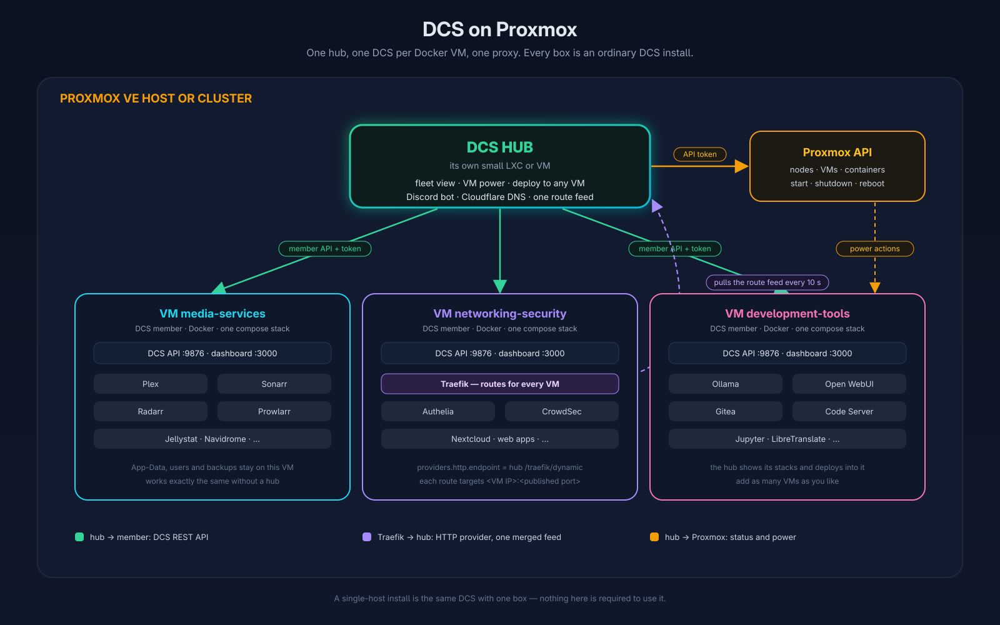

<p align="center">
  
  
  
  
  <a href="https://github.com/scotthowson/Docker-Compose-Skeleton-AIO/actions/workflows/ci.yml"></a>
  
</p>

# Docker Compose Skeleton — All-In-One

**Your whole homelab, managed from one repository and one browser tab — on one box, or across every
VM of a Proxmox host.**

DCS AIO bundles the Docker Compose Skeleton framework with its web UI. One clone, one setup script,
and you get a management dashboard on port 3000, a hardened REST API on port 9876, 151 one-click
service templates, automatic HTTPS routing through Traefik, Cloudflare DNS, optional Authelia SSO,
Discord notifications and a bot, plugins, schedules, backups, metrics, and a Proxmox page that
starts, stops and watches the VMs around it — all driven by plain Bash and Docker Compose.

```bash
git clone https://github.com/scotthowson/Docker-Compose-Skeleton-AIO.git ~/.Docker-Compose-Skeleton-AIO
cd ~/.Docker-Compose-Skeleton-AIO
./setup.sh
```

`setup.sh` checks Docker, creates `.env`, notices where it runs (bare metal, a Proxmox VM or LXC,
or the Proxmox host itself) and prints the URL of the web UI. Open it and follow the wizard.

---

## What you get

```
Browser ──► DCS-UI (container, :3000) ──/api/──► api-server.sh (:9876, Bash + socat)
                                                    ├─ docker compose  (Stacks/<category>/)
                                                    ├─ templates       (.templates/<name>/)
                                                    ├─ Traefik routes + Cloudflare DNS + DDNS
                                                    ├─ plugins, schedules, automations, webhooks
                                                    └─ metrics, health score, backups, snapshots
```

- **Dependency-ordered stacks** — ten categories start in order and stop in reverse:
  `core-infrastructure → networking-security → monitoring-management → development-tools →
  media-services → web-applications → storage-backup → communication-collaboration →
  entertainment-personal → miscellaneous-services`.
- **151 templates** — deploy Jellyfin, Nextcloud, Grafana, Vaultwarden, Immich, Home Assistant,
  Frigate, Minecraft and 143 more into any stack. Each deployment is security-scanned,
  port-checked, merged into the stack's compose file, given a Traefik route and a Cloudflare
  CNAME, connected to the proxy network and started. Undeploy reverses every step. Every template
  was deployed and watched until healthy before it shipped.
- **Proxmox** — link an API token and the Proxmox page shows every node, VM and LXC container with
  live load, starts, shuts down, reboots and resets them with a confirmation, and alerts when a
  guest stops on its own. The Discord bot gets `/vms` and `/vm`. See [docs/PROXMOX.md](docs/PROXMOX.md).
- **The VM is the stack** — on Proxmox, one DCS is the hub and every other stack is a VM the hub
  builds from the wizard's Stacks step: cloud image, Docker, an API-only DCS with that one stack,
  joined and started at boot, followed on a progress card. The hub's API answers for all of them,
  so the Stacks, Containers and Templates pages and the bot work across the whole host as one;
  Proxmox and DCS agree on every start and stop. VMs you made yourself join with a join code.
- **A Traefik in another VM or machine** — publish every route as a feed that a Traefik elsewhere
  (the networking VM, a friend's proxy) pulls with its HTTP provider; nothing to install there, and
  a new deployment is routed within seconds.
- **Wildcard HTTPS** — Traefik with a `*.yourdomain.com` certificate via the Cloudflare DNS
  challenge; every new service is reachable at `service.yourdomain.com` without touching a config.
- **Themes** — eight built-in looks (Nord, Dracula, Catppuccin, Solarized, Gruvbox, two light
  ones and the default) plus a Theme Studio: pick a palette with live preview, add CSS, save it
  on the server so every dashboard and phone follows it, export it as a file, install one from a
  file or an https address. Unsafe CSS is stripped.
- **Homarr** — apps DCS deploys or routes (the VMs' too) land on your Homarr dashboard; with an
  API key stored (Server Config → Integrations) they get a tile on the home board.
- **Authelia SSO** — optional single sign-on with 2FA, deployed and configured by the wizard.
  Once it is there, every service you deploy sits behind the portal — on the hub and in the VMs
  the hub builds — except templates whose apps bring their own clients (Plex, Jellyfin, Nextcloud,
  Immich, Vaultwarden, the *arr apps…; `"auth": "bypass"` in their `template.json`), and the
  deploy sheet's per-route switch decides otherwise. Services deployed before Authelia go behind
  it when it arrives.
- **A real API** — 331 endpoints covering stacks, containers, images, networks, volumes, logs,
  templates, routes, DNS, plugins, schedules, secrets, backups, snapshots, metrics, notifications,
  webhooks, automations, system updates and the web terminal. See [docs/API.md](docs/API.md).
- **Security by default** — accounts are mandatory on any non-loopback bind, a fresh install only
  answers the setup endpoints, viewers cannot change anything, `.env` is never sourced, compose
  files are scanned for privileged containers and dangerous mounts. See [SECURITY.md](SECURITY.md).

---

## Quick start

```bash
git clone https://github.com/scotthowson/Docker-Compose-Skeleton-AIO.git ~/.Docker-Compose-Skeleton-AIO
cd ~/.Docker-Compose-Skeleton-AIO
./setup.sh          # creates .env, directories and permissions; checks Docker; starts the API + web UI
```

The hidden directory keeps your home tidy and is where the self-updater, the recovery bundle and
the docs expect the install. `setup.sh` reports the operating system and the kind of machine it
runs on; inside a Proxmox VM or LXC it looks for the Proxmox API on the network and offers to link
it (an API token, see [docs/PROXMOX.md](docs/PROXMOX.md)), then prints the URL of the web UI when
it is healthy. The wizard walks through:

1. **Account** — the first admin account (PBKDF2-hashed, rate-limited, optional TOTP).
2. **Server** — domain, timezone, PUID/PGID, notifications (ntfy, Discord), Traefik with
   Authelia and CrowdSec, dynamic DNS, and — opened by itself on a Proxmox guest — the Proxmox
   link with a *Test connection* button; you choose which stack the proxy services land in.
3. **Stacks** — the stack directories to create.
4. **Review** — deploys Traefik (and Authelia, CrowdSec, ntfy), creates DNS records and starts
   the core stack.

After that:

```bash
./start.sh          # start every stack in dependency order (API first), pull updates, health check
./stop.sh           # stop in reverse order
./status.sh         # what is running
```

The API can also run as a system service:

```bash
.scripts/install-service.sh    # hardened systemd unit, runs as your user in the docker group
```

---

## Requirements

| Dependency | Used for |
|------------|----------|
| Docker Engine + Compose v2 | running the stacks |
| Bash 4+ | every script |
| jq | all JSON handling |
| python3 | PBKDF2 password hashing |
| curl, git, openssl | health checks, updates, TLS and tokens |
| socat (or ncat) | the API listener |

`./setup.sh` checks these tools, Docker and Compose before it changes anything, and offers the
fixes a fresh server needs: installing missing tools (through `apt`, `dnf`, `yum`, `pacman`,
`zypper`, `apk` or `xbps`), starting Docker and enabling it at boot, adding you to the `docker`
group (setup carries on under it, no log out). On Fedora and friends it also notices Docker's
SELinux confinement and, for a hub or member, the API port in firewalld; the first run offers the
boot service. `./start.sh` checks the tools again on every start.

---

## Templates

<details>
<summary><strong>All 151 templates by category</strong></summary>

| Category | Templates |
|----------|-----------|
| **Reverse proxies & web** | Traefik, Caddy, Nginx Proxy Manager, Nginx, Cloudflare Tunnel, Cloudflare Dynamic DNS, Docker Socket Proxy, WordPress, Shlink, Umami |
| **Dashboards & management** | Homarr, Homepage, Dashy, dash., Yacht, Komodo, Portainer CE |
| **Media** | Jellyfin, Plex, Sonarr, Radarr, Lidarr, Readarr, Prowlarr, Bazarr, Tautulli, Jellystat, Seerr, Jellyseerr, Wizarr, Kavita, Komga, Calibre-Web, Audiobookshelf, Navidrome, FlareSolverr, qBittorrent, Transmission, SABnzbd, MeTube |
| **Home automation** | Home Assistant, Mosquitto MQTT, Zigbee2MQTT, Node-RED, ESPHome, Frigate NVR |
| **Monitoring** | Grafana, Prometheus, Prometheus exporters (Node Exporter + cAdvisor), Loki, Uptime Kuma, Gatus, Netdata, Beszel + Beszel Agent, Scrutiny, InfluxDB, SpeedTest Tracker, Dozzle, Diun, Healthchecks, Changedetection.io, Watchtower |
| **Storage, photos & backup** | Nextcloud, Nextcloud All-in-One, MinIO, Syncthing, Duplicati, Kopia, File Browser, SFTPGo, PairDrop, Immich, PhotoPrism |
| **Databases & data** | PostgreSQL 16, MySQL, MariaDB, MongoDB 7, Redis 7, RedisInsight, Adminer, pgAdmin 4, phpMyAdmin, NocoDB, Metabase, Meilisearch |
| **Productivity & notes** | Memos, Trilium Notes, BookStack, Wiki.js, Obsidian LiveSync, Mealie, Tandoor Recipes, Grocy, Homebox, Actual Budget, Firefly III, Vikunja, Planka, Karakeep, Linkwarden, Paperless-ngx, Reactive Resume, draw.io, ONLYOFFICE Docs, Baïkal |
| **Development & automation** | Gitea, Code Server, Docker Registry, JupyterLab, Mailpit, n8n, Semaphore UI |
| **Security & network** | Authelia, Vaultwarden, CrowdSec, WireGuard Easy, Tailscale, Headscale, AdGuard Home, Pi-hole, Unbound |
| **Communication & publishing** | ntfy, Gotify, FreshRSS, SearXNG, PrivateBin, Flarum, Ghost, Mattermost, Mumble |
| **Entertainment & gaming** | EmulatorJS, RomM, Minecraft Server, Valheim Server, MonkeyType, Your Spotify, Pelican Panel + Wings |
| **Remote access** | RustDesk Server, Apache Guacamole, Webtop |
| **AI** | Ollama, Open WebUI + Ollama, LibreTranslate |
| **Tools** | BentoPDF, Excalidraw, IT-Tools, Stirling-PDF, Sablier, DCS Discord Bot |

</details>

Every template is a directory under `.templates/` with a `docker-compose.yml`, a `template.json`
and, when the app needs files before its first start, a `config/` directory. Deploy from the UI,
or from the API:

```bash
curl -s -H "Authorization: Bearer $TOKEN" -X POST http://localhost:9876/templates/jellyfin/deploy \
     -H 'Content-Type: application/json' \
     -d '{"target_stack":"media-services","auto_start":true,"variables":{"MEDIA_PATH":"/srv/media"}}'
```

<details>
<summary><strong>template.json reference</strong> — what a template can declare</summary>

| Field | Meaning |
|-------|---------|
| `name`, `title`, `description`, `icon`, `tags` | Identity shown in the gallery; the description should say what to do after the first start (default logins, where to click). |
| `category` | `media`, `monitoring`, `web`, `databases`, `development`, `tools`, `productivity`, `automation`, `security`, `network`, `storage`, `download`, `entertainment`… (the UI groups aliases such as `notes`, `photos`, `vpn`, `backup`). |
| `target_stack` | Stack the template lands in by default (`media-services`, `networking-security`, `monitoring-management`, `development-tools`, `communication-collaboration`, `storage-backup`, `entertainment-personal`, `web-applications`, `core-infrastructure`, `miscellaneous-services`). |
| `variables[]` | Inputs asked at deploy time: `name`, `label`, `description`, `default`, `required`; `type: "password"` hides the value; `options: [{value,label}]` renders a picker; `show_if: {OTHER_VAR: "value"}` hides a field until another one matches; `generate: "hex64"` (or a name ending in `_KEY`/containing `SECRET`) makes DCS fill an empty value with 64 random hex characters. |
| `config_path` | Directory under the stack's `App-Data/` that receives the template's `config/` files before the first start (never overwriting files that exist); `${VAR:-default}` placeholders in `.yml`, `.yaml`, `.conf` and `.env` files are filled from the deploy variables. |
| `route_skip` | Services that must not get a Traefik route, DNS record or proxy network — game, voice, MQTT and DNS ports (`["minecraft"]`). Services without a published port, or bound to `127.0.0.1`, are skipped anyway. |
| `route_override` | `{subdomain, port, protocol, use_host_ip, container}` for apps whose routable service is not in the compose file (Nextcloud AIO). |
| `singleton` | `true` when only one copy may exist on a host (Traefik, Portainer, Watchtower…). |
| `optional_services` | `[{service, label, description, default_enabled}]` — services the deploy dialog can leave out (`exclude_services` in the API body). |

Compose files use `${APP_DATA_DIR:-./App-Data}/<Name>/…` bind mounts (so **Nuke & reinstall**,
backups and the file editor find the data), `${PUID}`/`${PGID}`/`${TZ}` from the root `.env`, and a
`healthcheck` wherever the image has a tool to run one. `tests/lint.sh` validates every template's
compose file with its own defaults.

</details>

---

## The API

`.scripts/api-server.sh` is a single Bash program served by `socat`: one process per request,
JSON in and out, no runtime to install. It starts with `setup.sh`/`start.sh` or on its own:

```bash
.scripts/api-server.sh --bind 0.0.0.0        # foreground; --help lists the options
.scripts/api-server.sh --stop
```

- **Accounts and roles** — `admin` can do everything; `user` is a viewer with its own session,
  profile and 2FA. Registration is invite-only.
- **First run** — until the first admin exists only `POST /auth/setup`, the setup status endpoints
  and `GET /version` answer.
- **Behind the UI** — the DCS-UI container proxies `/api/` to the host; `API_TRUSTED_PROXIES`
  tells the API which proxies may set `X-Forwarded-For`, so rate limits and audit logs see the
  real client.
- **Fast to poll** — the read endpoints every dashboard polls (`/status`, `/health`,
  `/containers`, `/stacks`, `/events`, `/routes`, `/disks`, `/topology`…) come from a short
  shared cache. An answer past its TTL is returned at once and refreshed in the background
  (`X-DCS-Cache: hit|stale|miss` and `Age` tell you which), so a poll never waits for the Docker
  daemon; any write or audited event clears it. `GET /ping` is the no-auth liveness probe the
  UI's heartbeat times. `API_RESPONSE_CACHE=false` turns the cache off, `API_CACHE_MAX_STALE`
  (120 s) caps how old a served answer may be.
- **Reference** — [docs/API.md](docs/API.md) lists all 324 endpoints with their access level and
  is generated from the router by `.scripts/api-docs.sh`; `GET /` serves the same catalogue.

---

## Commands

| Command | Description |
|---------|-------------|
| `./setup.sh` | First-run setup (`--dry-run`, `--verbose`) |
| `./start.sh` | Start the API and every stack in order, pull updates, run a health check |
| `./stop.sh` | Stop every stack in reverse order and the API (`--force` for a short timeout) |
| `./restart.sh` | Stop then start |
| `./status.sh` | Container status per stack |
| `./compose.sh <stack> …` | `docker compose` for one stack with the root `.env`, the stack `.env` and the secret store applied (`--list` names the stacks) |

Everything under `Stacks/<category>/` is plain Compose, but `${SECRETS_name}` references are
resolved from the encrypted store only by DCS itself. A bare `docker compose` in a stack directory
prints `The "SECRETS_…" variable is not set` and starts the container with blank secrets, so when
you work by hand, go through the wrapper:

```bash
./compose.sh networking-security up -d --force-recreate --no-deps cloudflare-ddns
./compose.sh media-services logs -f plex
```

<details>
<summary><strong>Management utilities (<code>.scripts/</code>)</strong></summary>

| Script | Description |
|--------|-------------|
| `api-server.sh` | The REST API (`--bind`, `--port`, `--stop`, `--help`) |
| `api-docs.sh` | Regenerate `docs/API.md` and the `GET /` catalogue (`--check` for CI) |
| `install-service.sh` | Install the API as a systemd service |
| `stack-manager.sh` | Start/stop/restart/status/logs/pull for a single stack |
| `health-check.sh` | Container health table |
| `config-validator.sh` | Validate configuration, directories, compose files, ports (`--fix`) |
| `maintenance.sh` | Docker cleanup, disk analysis, orphan detection, log rotation |
| `docker-network-info.sh` | Network map |
| `image-tracker.sh` | Image age and staleness |
| `logs-viewer.sh` | Interactive log viewer |
| `backup-server.sh` | rsync-based server backup |

</details>

---

## Configuration

`setup.sh` copies `.env.example` to `.env` (mode 600). The important keys:

| Key | Default | Meaning |
|-----|---------|---------|
| `API_BIND` / `API_PORT` | `0.0.0.0` / `9876` | where the API listens (authentication is forced on non-loopback binds) |
| `DCS_UI_PORT` | `3000` | web UI port |
| `API_TRUSTED_PROXIES` | `172.16.0.0/12` | proxies allowed to set `X-Forwarded-For` (the Docker bridge range covers DCS-UI) |
| `API_IP_WHITELIST` | empty | comma-separated CIDRs allowed to call the API |
| `API_TLS_ENABLED` / `API_BEHIND_TLS_PROXY` | `false` | serve TLS directly, or mark the API as fronted by Traefik |
| `DOCKER_STACKS` | all ten | the stacks `start.sh`/`stop.sh` manage, in order |
| `LOG_LEVEL`, `ENABLE_COLORS`, `SHOW_BANNERS` | `INFO`, `true`, `true` | console output |

Per-stack settings live in `Stacks/<category>/.env`. Everything has a sensible default in
`.config/settings.cfg`; runtime environment variables override all of it
(`LOG_LEVEL=DEBUG ./start.sh`).

### Notifications

Two channels, both optional, set in `.env` (the setup wizard and the Server Config page write them):

| Key | Meaning |
|-----|---------|
| `NTFY_URL`, `NTFY_TOPIC`, `NTFY_TOKEN` | push notifications through an ntfy server |
| `DISCORD_WEBHOOK_URL` | a Discord channel webhook (or a `${SECRETS_name}` reference); every rule, automation, UPS event, self-update and test posts an embed there: your server as the author line, an emoji and colour per event, the facts as fields, the host and version in the footer, a title that links to the dashboard |
| `DISCORD_WEBHOOK_NAME`, `DISCORD_WEBHOOK_AVATAR` | the name and picture those posts appear with (default `DCS Manager` and the DCS icon) |
| `NOTIFY_COOLDOWN_MINUTES` | how long a container rule waits before repeating the same event for the same container while the problem lasts (default 60; disk rules wait 6 h, image rules a day, deploys and backups always post); a rule can set its own |
| `DASHBOARD_PUBLIC_URL` | where those links point (defaults to `https://ui.<PROXY_DOMAIN>`) |

Rules fire for unhealthy, stopped, busy or memory-hungry containers, low disk space, stacks that
stop or fail, deploys, image updates and ageing images, backups, automations and every change of
the server's overall health. Generic webhooks on the Notifications page follow the audit log
instead — containers stopping on their own, failing or recovering, every start/stop/restart/
deploy/nuke you perform, backups, DCS updates, failed sign-ins — grouped in a picker; they get the
same embed when they point at Discord, text when they point at Slack, and a JSON envelope elsewhere.

Commands from Discord are a separate integration: deploy the **DCS Discord Bot** template
(`ghcr.io/scotthowson/dcs-discord-bot`), which signs in to the API with its own **bot account**
(day-to-day operations only, no access to accounts, secrets, files or DCS itself) and answers
`/status`, `/usage`, `/health`, `/containers`, `/stacks`, `/top`, `/disk`, `/updates`, `/logs`,
`/routes`, `/power`, `/security`, `/schedules`, `/audit`, `/dcs`, and for the Discord users and
roles you name `/start`, `/stop`, `/restart`, `/update`, `/deploy`, `/backup`, `/prune`, `/run`,
`/unban` — with buttons, confirmations, and a channel lock. **Every step, ID and permission is in
[docs/DISCORD.md](docs/DISCORD.md)**, together with Rich Presence for the desktop app and the
brand kit for avatars and banners.

### Services that start on demand (Sablier)

Deploy the **Sablier** template and any container behind a Traefik route can sleep when idle:
open it on the Containers page and press **Start on demand**, then choose how long it may idle
(5 minutes to 12 hours) and which waiting page visitors see (ghost, shuffle, hacker-terminal,
matrix) — the same choices the deploy sheet offers. DCS writes the Sablier middleware onto its
route, last in the chain so a visitor passes CrowdSec and Authelia before anything is woken
(declaring the plugin in Traefik's static config if an older install lacks it); Traefik shows
the waiting page on the first request and Sablier stops the container once it has idled that
long. The same button, or the **on demand** badge in the list, brings the settings back to
change them or to serve the container normally again. Health, Uptime and the container list
show such containers as **on demand** instead of stopped, and they raise no "container
stopped" notification.

### Themes for your apps (theme.park)

For the apps [theme.park](https://theme-park.dev) themes — the *arr family, qBittorrent,
Plex, Jellyfin, Tautulli, Overseerr, Uptime Kuma, Portainer, Dozzle and more — a container's
page has a **Theme** button: pick one of the official or community themes (Nord, Dracula,
Catppuccin, Rose Pine…) and the app's add-ons, and DCS puts the theme.park Traefik middleware
on its route. The theme reaches the app wherever it is opened through that route; nothing
inside the container changes, and **Remove theme** gives the app its own look back. In a
Proxmox fleet the hub's Traefik themes a VM's apps the same way.

### Homarr from the Containers page

A container's page shows **Add to Homarr** under its health badge when the app is not on your
Homarr yet, and **✓ Added** when it is: the same registration the deploy sheet's switch
makes, with the template's name and icon, and a tile on the home board once Homarr's API key
is stored (Server Config → Integrations).

### Intrusion detection (CrowdSec)

The setup wizard offers CrowdSec next to Traefik; it can also be deployed later from Templates.
CrowdSec reads Traefik's JSON access log with the community collections, DCS registers a Traefik
bouncer so banned addresses are refused at the proxy (no root needed), and every decision is
posted to your Discord webhook as an embed: what was blocked in plain words, the address with its
flag and network, hits, duration, scenario, and links to CrowdSec CTI and AbuseIPDB
(`POST /crowdsec/notifications {test: true}` re-applies the template to a running CrowdSec and
posts a sample). The host firewall bouncer (nftables, root) is a separate install described in the
CrowdSec docs; DCS never touches host packages.

### Nuke & reinstall a container

When an app has wedged itself (a lost admin password, a corrupt database, a config you cannot
untangle), the container's page offers **Nuke & reinstall**: the container is removed, the
App-Data folders it owns are moved to `App-Data/.trash` (kept `RESET_TRASH_KEEP_DAYS`, default 7,
so a mistake can be undone by hand), its own named volumes go when you tick them, and the service
is created again from the compose file — a first install, with every setting coming from the
compose file and `.env` like the first time. Folders another container also mounts are never
touched; the preview lists everything with sizes before you type the container's name to confirm.

### Accounts and roles

Three roles: **admin** (everything), **user** (read-only viewer), and **bot** — for chat bots and
scripts: day-to-day operations (start, stop, restart, update, deploy, back up, prune, run
schedules, unban) with no access to accounts, secrets, files, `.env`, the host or DCS itself, and
several sessions at once even in single-session mode. Create accounts on the Users page or with
`POST /auth/users`, change roles there or with `POST /auth/users/{username}/role`.

### Updating

The Updates page checks the release channel set by `UPDATE_CHANNEL` in `.env` (`stable`, the
newest tagged release, is the default; `main` follows every commit), shows the release notes and
applies the update with one click. Files you edited under `Stacks/`, `.templates/`, `.api-auth/`
and `.plugins/` are kept exactly as they are. A framework file you patched by hand is replaced
only when you tick the box, and the old copy lands in `.data/update-backups/`. The API restarts
itself afterwards (no root needed) and a backup tag lets you roll back. By hand,
`git pull --ff-only` in the install directory does the same without the safety net.

### Recovery bundle

The Backup page writes one encrypted archive that rebuilds this install anywhere: the root `.env`,
the secret store with its key, accounts, rules and dashboard layouts, schedules, every stack's
files, the Traefik and Authelia data, templates and plugins (App-Data of chosen stacks on request).
Store the passphrase as the secret `RECOVERY_PASSPHRASE`, point `RECOVERY_REMOTE` at an rsync
target or a mounted drive for an off-box copy, and add a `recovery` schedule. On a fresh box the
setup wizard offers **Restore a recovery bundle** before the first account is created; on a
running one the Backup page restores a bundle after a pre-restore snapshot.

### Power (UPS)

Set `UPS_ENABLED=true` and point DCS at a NUT server (`UPS_NUT_HOST`, `UPS_NUT_PORT`, `UPS_NAME`;
the `nut-upsd` template serves a USB UPS from a container) or install apcupsd. The dashboard
Power card shows charge, runtime and load; every switch to battery and back is announced on your
notification channels; below `UPS_SHUTDOWN_CHARGE` percent or `UPS_SHUTDOWN_RUNTIME` seconds the
stacks are stopped cleanly, `UPS_HOST_SHUTDOWN_CMD` runs when set, and `UPS_START_ON_POWER=true`
starts them again when mains returns.

### Unattended updates

A `dcs-update` schedule (target `images` to pull image updates too) applies the channel's release
outside the listener, restarts the API, waits `UPDATE_HEALTH_GRACE` seconds and rolls back to the
backup tag when the health score dropped by `UPDATE_ROLLBACK_DROP` points. The outcome is posted
to your notification channels and listed on the Updates page. Framework files you edited by hand
are never replaced unattended — the Updates page asks you first.

### Proxmox



Link an API token (Datacenter → Permissions → API Tokens, with `VM.Audit`, `VM.PowerMgmt` and
`Sys.Audit` on `/`) in **Server Config → Proxmox**, in the wizard, or when `setup.sh` asks, and:

- the **Proxmox** page lists every node with CPU, memory, disk and uptime, and every VM and LXC
  container with its state and load; admins start, shut down, stop, reboot, reset, suspend and
  resume them, each with a confirmation that says what it does; recent tasks are listed;
- a **dashboard card** shows the same at a glance;
- power actions are **audited** (`proxmox_vm_start` …) and reach webhooks and Discord; a watcher
  raises `proxmox_vm_stopped` when a guest stops without DCS asking, `proxmox_vm_started` when it
  comes back — both are notification-rule triggers;
- the **Discord bot** answers `/vms` and `/vm <name> <action>`.

`GET /proxmox/status|nodes|vms|tasks`, `GET /proxmox/vms/{node}/{qemu|lxc}/{vmid}`,
`POST /proxmox/vms/{node}/{type}/{vmid}/{action}` and `POST /proxmox/test` are the endpoints;
`PROXMOX_URL`, `PROXMOX_TOKEN_ID`, `PROXMOX_TOKEN_SECRET` (or the secret of that name),
`PROXMOX_VERIFY_TLS` and `PROXMOX_NODE` the settings.

### The fleet: the VM is the stack

Put one DCS in a small LXC or VM as the **hub** (`./setup.sh` asks which role a machine has). It
keeps the dashboard, the Proxmox link and `core-infrastructure`; **every other stack is a VM**
the hub builds: the wizard's Stacks step shows a *Hub / VM* switch per stack with cores, RAM and
disk, and a VM-settings panel prefilled from Proxmox and your network (node, storage, bridge, the
first address, gateway, DNS). *Complete setup* hands the plan to the hub, which builds the VMs
one after another — Debian cloud image imported once, a VM with a cloud-init drive and a static
address, the hub's ssh key, a bootstrap that installs Docker and the hub's own DCS code, an
unattended member setup that creates the admin (your username, a generated password kept in the
hub's secret store), one stack, an API without a dashboard, boot services, and the join — all on
a progress card, resumable step by step, and the hub's own `Stacks/<name>` (compose and `.env`,
never `App-Data`) moves into the VM and starts there — the VM is born as the stack. *New VM* on
the VMs page or the Proxmox page builds one more. A stack counts as the hub's own when it is in
`DOCKER_STACKS` or running there — the `Stacks/` folders the repository ships never get in the
way of a VM. On a hub the Stacks page is the **VMs** page: open a VM for the containers running
in it, their controls, the compose editor and the VM's power. VMs are built from Debian (the
default), Ubuntu, Fedora or AlmaLinux cloud images, a cloud image already on Proxmox or from a
URL — or from an installer ISO on Proxmox, installed by hand and joined with one line. The hub
bakes a DCS template once and clones it for every VM after that, so a build takes about 40 s.

The hub's **API is the fleet API**: `GET /stacks` lists every VM's stack next to its own with a
*VM* chip, and stacks, containers and template deploys that live in a VM are forwarded to that
VM's DCS with your own role checked on the hub — so the Stacks, Containers and Templates pages,
the bot's `/stacks` and `/fleet` and the API work across the whole host as one. The Proxmox page
shows each VM with its stack and containers next to the power buttons; stopping a VM there is the
stack going down, and it comes back at boot. VMs you made yourself join with a **join code**
(`DCS_HUB_URL=… DCS_JOIN_TOKEN=… ./setup.sh`, or `./setup.sh --join`), the wizard scans the VMs
for DCS installs, and every member's routes ride along in the hub's Traefik feed. A member that
stops answering raises `fleet_member_down`; a finished build `fleet_vm_ready`. Nothing is
scheduled or moved between VMs: a control plane over independent compose hosts, and a VM that
loses its hub keeps running. The hub keeps the VMs on its own DCS version: the Updates page
lists every VM's version, *Update all VMs* hands each one the hub's code (data, accounts and
stacks stay; the API restarts in place), a hub update takes the VMs along, and every list page —
health, images, networks, volumes, snapshots, automations, schedules, secrets, activity — opens
on *Everywhere* with a capsule per row saying which VM it lives on. A VM's events reach the hub,
which names the VM in its Discord and NTFY notifications, and one click snapshots the hub and
every VM at once.
[docs/PROXMOX.md](docs/PROXMOX.md) is the full guide, from the
token roles (PVEVMAdmin, PVEDatastoreAdmin, PVESDNUser) to the troubleshooting table.

### A Traefik in another VM or machine

In a hub-and-VMs layout the Traefik in the networking VM must serve containers that live in the
other VMs; the same goes for a proxy on another box. Switch on **Server Config → Traefik & DNS → Publish routes
as a feed**. DCS mints a token and shows the snippet for that Traefik's static configuration:

```yaml
providers:
  http:
    endpoint: "http://192.168.1.20:9876/traefik/dynamic?token=…"
    pollInterval: "10s"
```

Every route DCS makes is served with its service rewritten to `<target host>:<published port>`
and the middlewares you name on that side; the panel shows when the proxy last pulled and which
routes it could not offer (a container that publishes no host port). A host without its own
Traefik keeps its route files in `.data/routes`, so deploys and Cloudflare DNS keep working; a
local Traefik and the feed can be on together. `GET /traefik/dynamic?token=…` is the endpoint,
`GET /traefik/feed/status` and `POST /traefik/feed/token` the admin side.

### Running inside a VM (Proxmox, KVM, QEMU)

DCS needs nothing special in a virtual machine. What helps is the **QEMU guest agent**, an OS
package the hypervisor talks to: with it Proxmox can freeze the filesystem for consistent
snapshot backups (your `App-Data` and volumes live on that filesystem), read the VM's IP
addresses and shut the VM down cleanly. The System page shows what the host runs on and whether
the agent is installed, running and reachable:

```bash
sudo apt install qemu-guest-agent && sudo systemctl enable --now qemu-guest-agent
```

then switch on **Options → QEMU Guest Agent** for the VM in Proxmox. `GET /system` reports the
same facts as `virtualization` and `guest_agent`; `setup.sh` and `GET /setup/defaults` report
whether the machine is a Proxmox guest and where the Proxmox API answers.

---

## Plugins

Plugins add lifecycle hooks (`pre-deploy`, `post-start`, ...) and dashboard cards. Four ship
enabled-ready in `.plugins/`, and a catalogue of 23 more (deploy guards, backups, monitors,
security audits, notifiers...) lives in `.plugins-catalog/`: install any of them from the Plugins
page or with `POST /plugins/catalog/{name}/install`, then enable it. The hook contract (JSON
context on stdin, the environment a hook sees, timeouts, state directory) and the API are
described in [.plugins/README.md](.plugins/README.md).

---

## Troubleshooting

- **The dashboard says "Connection Unstable" / "Connection Restored" in a loop, or the wizard never
  appeared.** The browser tab holds a session from an earlier install. Reload the page
  (Ctrl+Shift+R) or sign out; with web UI 2.23.1 or newer this happens automatically.
- **`API server failed to start`** after `./setup.sh`: `logs/api-server.log` names the process
  that already holds the port. Stop it or change `API_PORT` in `.env`.
- **After a power loss Traefik is up but no site answers** until it is restarted: the stacks came
  up before Traefik could load its plugins or reach the Docker socket. `start.sh --boot` (what the
  `dcs-stacks` service runs) probes every route once the stacks are healthy and restarts Traefik
  if none answer; `GET /routes/health` shows the probe and `POST /routes/reconcile` runs it now.
- **CrowdSec banned my own address** (the site works from the phone but not from the PC): the
  Protection card on the dashboard has "Unban me" and "Trust my address"; the whitelist follows
  the DDNS/public address every ten minutes, and `CROWDSEC_TRUSTED_IPS` in `.env` pins more.
- **DNS records**: the DNS & Routes page manages the Cloudflare zone (every record type, proxy
  toggle, TTL, comments) and links each record to the DCS route that uses it; records a route
  needs cannot be deleted by accident. Store the Cloudflare API token as the secret
  `CF_DNS_API_TOKEN` (the setup wizard does this); `.env` files reference it as
  `${SECRETS_CF_DNS_API_TOKEN}`, so it never sits in plain text.
- **Run Command on the Containers page** runs without a terminal and with stdin closed:
  interactive programs (`ollama run`, editors, shells) exit or time out after 30 seconds; use the
  Terminal page for those.
- **The dashboard behind Traefik answers 502** after changing `DCS_UI_PORT`: that setting only
  moves the host port. Traefik reaches the container over the proxy network, so the route must
  keep `http://DCS-UI:3000` (the port nginx listens on inside the container).
- **Phone or desktop app**: every web UI release on GitHub ships an Android APK and Linux/Windows
  installers; the Updates page links to the latest release. Nothing of that is part of a DCS
  installation.
- **Connecting from outside the house**: the API is reachable through the dashboard's address,
  `https://ui.<your domain>/api` — the dashboard's nginx forwards `/api/` to the API, Traefik
  and Cloudflare do the TLS. Type the dashboard address into the app's Connect screen; it finds
  the `/api` path and the port by itself. Port 9876 never needs to be opened to the internet.
- **A viewer account gets 403** on an action: by design. Only admins change the system; see
  [docs/API.md](docs/API.md) for the access level of every endpoint.
- **Everything else**: `.scripts/config-validator.sh` checks the installation, `tests/lint.sh` the
  code, and `logs/` holds the API and framework logs.

## Development

```bash
tests/lint.sh       # bash -n, shellcheck, compose validation of every stack and template, API reference freshness
tests/smoke.sh      # 60+ API checks against the request handler in an isolated temporary installation
```

Both run in CI on every push and pull request. After adding or changing a route, run
`.scripts/api-docs.sh` so the reference and the `GET /` catalogue stay in sync. The web UI lives in
its own repository: [Docker-Compose-Skeleton-UI](https://github.com/scotthowson/Docker-Compose-Skeleton-UI).

---

## License

[MIT](LICENSE)
